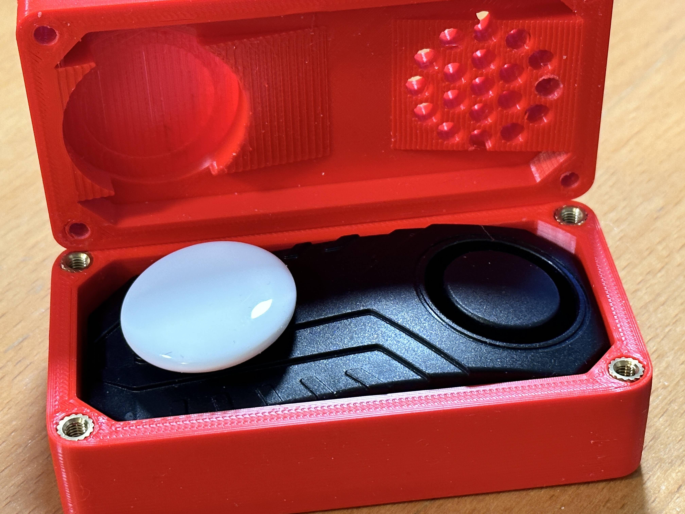

A no-frills case for "those" well-known bicycle alarms and an Apple Airtag. Mounts onto the bottle holder threads.

This case does not have a magic trick for opening and closing but relies on opportunistic thieves not having the required tools on them. 

Someone who **does** have the tools will still have to endure the alarm for several minutes.

Project includes:

- top and bottom case
- flat anti-leverage shim for my own bike's top tube, which is 100% flat at the bottle holder
- An example round-tube shim for 1.25 in / 31.75 mm tubes is included, more will be added to the project on request
- Individual shim customization may be required to accommodate offsets around the bottle holder threads

Assembly required:

- 4x M4 heat-set nuts (soldering iron required, too)
- 2x countersunk screws for the mounting holes (probably M5x16)
- 4x M4x20 stainless countersunk screws for the top case
- A bit of foam or tissue, in case of rattling.

Notes:

- For drainage, the unsealed seam between bottom and top case, together with the permeability of the material, will have to suffice.
- My own case is printed in bright red PLA at 100% infill and uses security screws for the top case.
- I suggest less than 100% infill so the tiny amount of PLA displaced by the heat-set nuts has a place to settle.

Links:

- [Github](https://github.com/mschmitt/bicycle-alarm-airtag)
- [Printables](https://www.printables.com/de/model/399618-bicycle-alarm-and-airtag-case)
- [Thingiverse](https://www.thingiverse.com/thing:5842363)

